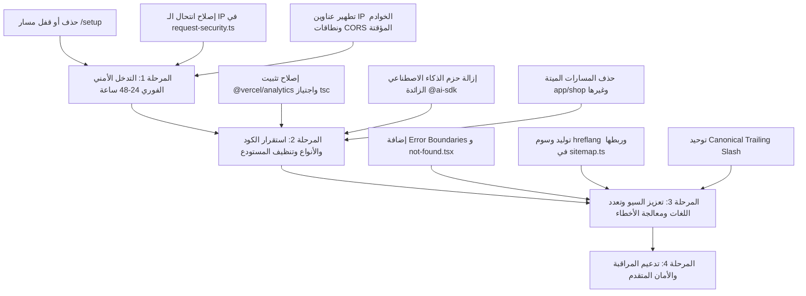

# تقرير الفحص الأمني والمعماري الشامل — AliFleet
**مشروع Next.js 16 + Headless WordPress & WooCommerce**

- **التاريخ:** 8 سبتمبر 2026
- **الصفة:** Senior Cybersecurity Expert & Full-Stack Architect
- **نوع الفحص:** فحص أمني ومعماري شامل وقراءة متعمقة سطرًا بسطر (Deep Security & Architecture Audit — STRICTLY READ-ONLY).
- **نطاق الكود:** مسارات Next.js (App Router)، الـ Proxy / Middleware، مسارات API Routes، عميل GraphQL، ترويسات الأمان، إعدادات i18n و SEO، ملحقات ووردبريس (mu-plugins)، ملفات البيئة وحزم الاعتماد.

---

## 1. ملخص حالة المشروع والنواقص الأساسية (Executive Overview)

### أ. الرؤية الهندسية والمعمارية العامة
يعتمد مشروع **AliFleet** على معمارية حديثة من نوع **Headless E-Commerce**:
- **الواجهة الأمامية (Storefront):** مبنية بواسطة **Next.js 16.3.4 (App Router)** مع React 19، وتعمل كخادم واجهة مستقل تمامًا يتعامل مع الزوار، ويدير عربة التسوق محليًا، ويعتمد الـ Server Actions والـ Route Handlers لنقل وتأمين العمليات الحساسة.
- **الواجهة الخلفية (Backend & Data Store):** تعتمد على **WordPress / WooCommerce** كمخزن مركزي للمنتجات والسيارات والمقالات وإدارة الطلبات، مع التواصل حصريًا عبر **WPGraphQL** و **WooCommerce REST / AJAX APIs** ونظام إضافات مخصصة (Must-Use Plugins: `alifleet-cms.php` و `alifleet-headless-redirect.php`).

### ب. نتائج الاختبارات الصامتة غير المدمرة (Non-Destructive Testing Results)

| الاختبار | الأداة المستخدمة | النتيجة | التفاصيل والملاحظات |
|---|---|---|---|
| **فحص الثغرات في المكتبات** | `npx pnpm audit` | ✅ **0 ثغرات** | صفر ثغرات أمنية معروفة (CVEs) في كافة الحزم المثبتة. |
| **فحص الالتزام الأمني للكود** | `node scripts/security-check.mjs` | ✅ **22/22 ضابط نجح** | نجاح كامل لجميع الضوابط الـ 22 ضد التراجعات الأمنية السابقة. |
| **فحص التوافق البرمجي والتنسيق** | `npm run lint` (`eslint .`) | ✅ **0 أخطاء / 0 تحذيرات** | الكود متوافق بنسبة 100% مع معايير ESLint و Next.js Linter. |
| **فحص الأنواع الصارمة** | `npx tsc --noEmit` | ❌ **خطأ برمجي كاسر (TS2307)** | تعطل فحص الأنواع لوجود حزمة `@vercel/analytics` داخل مجلد خاطئ. |

### ج. تقييم الموقف الأمني الشامل
1. **نقاط القوة الهندسية الحالية:**
   - تم سد ثغرة الشات المفتوح (`app/api/chat/route.ts`) بالتعطيل الكامل (Fail-Closed).
   - تم تقييد مسارات البروكسي (`app/cms/` و `lib/checkout/proxy.ts`) بقوائم بيضاء وحدود دقيقة لأحجام الطلبات والردود.
   - حماية جلسات المستخدمين عبر كوكيز `httpOnly` و `SameSite=Lax` مع فرض `Secure: true` في بيئة الإنتاج وعدم حفظ أي أسرار في `localStorage`.
   - تنظيف المحتوى القادم من ووردبريس (`dangerouslySetInnerHTML`) باستخدام قائمة بيضاء صارمة للوسوم في `lib/wp/sanitize-html.ts`.
   - عزل استعلامات ووردبريس GraphQL الحساسة وتشفير بيانات نقل جلسة العميل (Handoff Token) عبر HMAC-SHA256.

2. **أخطر الثغرات والنواقص المكتشفة في هذا الفحص:**
   - **🔴 ثغرة تسريب معلومات البنية التحتية والـ IP الداخلي:** صفحة `/setup` (`app/setup/page.tsx`) منشورة ومتاحة للعامة، وتكشف للمهاجمين الـ IP الحقيقي لسيرفر ووردبريس، وروابط `wp-admin`، وتعليمات تجاوز Cloudflare WAF، وإعدادات داخلية حرجة.
   - **🔴 تسريب عناوين IP حقيقية لخوادم الإنتاج (Origin IP Leaks):** وجود 3 عناوين IP مختلفة ومسجلة نصيًا في كود الـ mu-plugins وصفحة الإعداد، مما يسمح بتجاوز الحماية المركزية والبروكسي العكسي ومهاجمة السيرفر المشترك مباشرة.
   - **🔴 ثغرة انتحال IP العميل (IP Spoofing) عبر `X-Forwarded-For`:** اعتماد أول عنوان في ترويسة `X-Forwarded-For` وتوقيعه رقميًا وتمريره لووردبريس، مما يسمح لأي مهاجم بتخطي الـ Rate Limiting وتنفيذ هجمات تخمين كلمات المرور بسهولة.
   - **🟡 عيوب الـ CSP والـ CORS:** استمرار السماح بـ `'unsafe-inline'` في `script-src`، وتضمين نطاقات تجريبية قديمة (`vercel.run` و `sslip.io`) في قائمة CORS الموثوقة.
   - **🟡 غياب صفحات معالجة الأخطاء (Error Boundaries):** عدم وجود `error.tsx` أو `not-found.tsx`، مما يتسبب في عرض شاشات خطأ غير منسقة لزوار الموقع عند حدوث أي استثناء برمجـي.
   - **🟡 نواقص السيو وتعدد اللغات:** غياب تام لوسوم `hreflang` و `alternates.languages`، وتناقض الروابط المعيارية (Canonical URLs) مع قواعد الـ trailing slash الخاصة بـ `proxy.ts`.

---

## 2. جدول الثغرات الأمنية (Security Vulnerabilities Matrix)

مرتبة حسب درجة الخطورة الدولية (CVSS Severity):

| المعرف | درجة الخطورة | اسم الثغرة | مكان الثغرة بدقة في الكود | الأثر الأمني المتوقع |
|---|---|---|---|---|
| **VULN-01** | 🔴 حرجة (Critical) | صفحة إعداد عامة تكشف البنية التحتية والـ IP الحقيقي للسيرفر وروابط الإدارة | [app/setup/page.tsx](file:///Users/user/Documents/GitHub/alifleet/app/setup/page.tsx#L12-L175)<br>[app/robots.ts](file:///Users/user/Documents/GitHub/alifleet/app/robots.ts#L19) | كشف كامل للبنية التحتية، الـ IP المباشر، إرشادات تخطي Cloudflare، وروابط الأدمن لأي زائر. |
| **VULN-02** | 🔴 حرجة (Critical) | تسريب عناوين IP حقيقية متعددة لخوادم الإنتاج والـ VPS المشترك | [alifleet-headless-redirect.php](file:///Users/user/Documents/GitHub/alifleet/wordpress/mu-plugin/alifleet-headless-redirect.php#L132-L150)<br>[alifleet-cms.php](file:///Users/user/Documents/GitHub/alifleet/wordpress/mu-plugin/alifleet-cms.php#L35)<br>[app/setup/page.tsx](file:///Users/user/Documents/GitHub/alifleet/app/setup/page.tsx#L12) | تجاوز تام لحماية Cloudflare/WAF، استهداف السيرفر المباشر بالهجمات، وتهديد التطبيقات الأخرى المشاركة لنفس الـ VPS. |
| **VULN-03** | 🔴 حرجة (Critical) | ثغرة انتحال عنوان العميل (IP Spoofing) عبر `X-Forwarded-For` تؤدي لتجاوز Rate Limiting | [lib/wp/request-security.ts](file:///Users/user/Documents/GitHub/alifleet/lib/wp/request-security.ts#L20-L28)<br>[alifleet-cms.php](file:///Users/user/Documents/GitHub/alifleet/wordpress/mu-plugin/alifleet-cms.php#L138-L166) | إبطال فاعلية Rate Limiting في تسجيل الدخول واستعادة الحساب، وفتح الباب أمام هجمات Brute-Force بدون توقف. |
| **VULN-04** | 🟡 متوسطة (Medium) | ثغرات وضعف سياسة أمان المحتوى (CSP Weaknesses) | [next.config.mjs](file:///Users/user/Documents/GitHub/alifleet/next.config.mjs#L56-L65) | السماح بـ `'unsafe-inline'` يلغي الحماية ضد هجمات XSS المضمنة، وفتح مصادر الصور والوسائط لجميع نطاقات HTTPS دون تقييد. |
| **VULN-05** | 🟡 متوسطة (Medium) | سماح CORS بنطاقات تجريبية ومؤقتة غير خاضعة للسيطرة | [alifleet-cms.php](file:///Users/user/Documents/GitHub/alifleet/wordpress/mu-plugin/alifleet-cms.php#L35-L40) | إمكانية استغلال نطاقات منتهية الصلاحية (`vercel.run` / `sslip.io`) لتنفيذ استعلامات GraphQL موقّعة ومحمية بالكوكيز عبر المتصفح. |
| **VULN-06** | 🟡 متوسطة (Medium) | ثغرة تسريب زمني محتمل في مقارنة سر التحديث (Timing Side-Channel) | [app/api/revalidate/route.ts](file:///Users/user/Documents/GitHub/alifleet/app/api/revalidate/route.ts#L55-L65) | عدم تطبيق التشفير التثبيتي (Fixed-width Hashing) قبل الفحص الزمني يتيح قياس طول السر من خلال سرعة الاستجابة. |
| **VULN-07** | 🟡 متوسطة (Medium) | تعطل بروكسي الصور بالكامل عند غياب متغير البيئة `WORDPRESS_GRAPHQL_ENDPOINT` | [app/api/img/route.ts](file:///Users/user/Documents/GitHub/alifleet/app/api/img/route.ts#L28-L33) | توقف جميع صور المتجر والسيارات وعرض أخطاء 400 بسبب رمي خطأ عند محاولة تحليل URL فارغ دون استخدام القيمة الاحتياطية. |
| **VULN-08** | 🟡 متوسطة (Medium) | غياب الـ Rate Limiting في طبقة الواجهة الأمامية (Next.js Edge / Actions) | [lib/auth/actions.ts](file:///Users/user/Documents/GitHub/alifleet/lib/auth/actions.ts#L55-L97)<br>[lib/checkout/actions.ts](file:///Users/user/Documents/GitHub/alifleet/lib/checkout/actions.ts#L40-L100) | إمكانية إغراق خادم Next.js بطلبات Server Actions متزامنة تترجم لطلبات مكثفة على قاعدة بيانات ووردبريس، مما يسبب إنهاك الخادم (DoS). |
| **VULN-09** | 🟡 متوسطة (Medium) | نمط مطابقة نطاق واجهة المتجر شديد الفضفاضية (`*.vercel.app`) | [lib/checkout/proxy.ts](file:///Users/user/Documents/GitHub/alifleet/lib/checkout/proxy.ts#L192-L202) | دالة `isTrustedStorefrontHost` تثق بأي نطاق ينتهي بـ `.vercel.app` مما قد يسمح لأي تطبيق مستضاف على Vercel بالتظاهر بأنه المتجر الأصلي. |
| **VULN-10** | 🟢 منخفضة (Low) | معرّف Meta Pixel ثابت في الكود كقيمة احتياطية | [lib/analytics/meta-pixel.ts](file:///Users/user/Documents/GitHub/alifleet/lib/analytics/meta-pixel.ts#L8) | تسريب أحداث وبيانات تتبع التصفح في بيئات التطوير والاختبار إلى حساب بيكسل الإنتاج الحقيقي. |
| **VULN-11** | 🟢 منخفضة (Low) | غياب توجيهات Preload و SubDomains في ترويسة HSTS لـ Next.js | [next.config.mjs](file:///Users/user/Documents/GitHub/alifleet/next.config.mjs#L106) | عدم إمكانية تضمين النطاق في قائمة HSTS Preload للمتصفحات لعدم ذكر `includeSubDomains; preload`. |
| **VULN-12** | 🟢 منخفضة (Low) | خريطة الموقع الافتراضية لووردبريس غير معطلة على الباك إند | [alifleet-cms.php](file:///Users/user/Documents/GitHub/alifleet/wordpress/mu-plugin/alifleet-cms.php) | إمكانية استكشاف مستخدمي ووردبريس عبر `/wp-sitemap-users-1.xml` في حال الوصول المباشر للسيرفر الداخلي. |
| **VULN-13** | 🟢 منخفضة (Low) | استثناء مسار الحساب غير مكتمل في ملف `robots.ts` | [app/robots.ts](file:///Users/user/Documents/GitHub/alifleet/app/robots.ts#L19) | استثناء `/account/` مع نسيان مسار `/my-account` مما يتيح لعناكب البحث محاولة فهرسته. |

---

### تفصيل الثغرات الأمنية المشروحة

#### 🔴 VULN-01: صفحة إعداد عامة ومكشوفة بالكامل تسرب البنية التحتية
- **الموقع في الكود:** [app/setup/page.tsx:12-175](file:///Users/user/Documents/GitHub/alifleet/app/setup/page.tsx#L12-L175)
- **المشكلة:** الصفحة متاحة للعموم تحت المسار `https://alifleet.com/setup`، ولم يتم قصرها على بيئة التطوير (`NODE_ENV === 'development'`) أو حمايتها بأي كود سري.
- **البيانات المسربة:**
  1. الـ IP المباشر والنطاق السري للخادم الداخلي: `http://wordpress-yo985p014jyz554zjo2oo6w7.169.58.19.247.sslip.io`.
  2. روابط مباشرة لتسجيل دخول ولوحة تحكم ووردبريس: `${WP_DOMAIN}/wp-admin` وتعديل المنتجات والمقالات وإعدادات WooCommerce.
  3. اسم المستخدم الافتراضي: `WORDPRESS_USER=admin`.
  4. تعليمات تفصيلية بكيفية عمل استثناء في Cloudflare WAF لتمرير طلبات POST على `/graphql`، وهو ما يوضح للمهاجم كيفية تجاوز حماية الـ WAF!
- **الخطورة:** استغلال المهاجم لهذه الصفحة يمنحه فوراً خارطة طريق لاختراق خادم ووردبريس مباشرة متجاوزاً كل طبقات الحماية.

#### 🔴 VULN-02: تسريب عناوين IP حقيقية متعددة لخوادم الاستضافة في الكود (Origin IP Leaks)
- **المواقع في الكود:**
  - `wordpress/mu-plugin/alifleet-headless-redirect.php:132, 136` -> `http://wordpress-nq1w5m20z22e258i6ttd1axo.213.199.49.147.sslip.io`
  - `app/setup/page.tsx:12, 101` -> `http://wordpress-yo985p014jyz554zjo2oo6w7.169.58.19.247.sslip.io`
  - `wordpress/mu-plugin/alifleet-cms.php:35` -> `http://rbzfx3doqcg2vx1hyichhewe.169.58.176.172.sslip.io`
- **المشكلة:** كود المشروع يحتوي على 3 عناوين IP مختلفة لخوادم سحابية تم كتابتها وتثبيتها يدويًا داخل الملفات.
- **الخطورة:** طبقاً لوثيقة [alifleet-agent.sudoers:22-24](file:///Users/user/Documents/GitHub/alifleet/wordpress/server/alifleet-agent.sudoers#L22-L24)، فإن هذا السيرفر مشترك ويضم 16 كونتينر و 6 تطبيقات إنتاجية أخرى. معرفة عنوان الـ IP الحقيقي تمكّن المخترقين من توجيه هجمات حجب الخدمة (DDoS)، والمسح المنفذي (Port Scanning)، ومهاجمة خادم Traefik أو SSH مباشرة متخطين أي بروكسي حماية.

#### 🔴 VULN-03: ثغرة انتحال عنوان العميل (IP Spoofing) لتجاوز Rate Limiting
- **الموقع في الكود:** [lib/wp/request-security.ts:20, 27-28](file:///Users/user/Documents/GitHub/alifleet/lib/wp/request-security.ts#L20-L28)
- **المشكلة:** تقوم الدالة `validClientAddress` باستخراج أول قيمة من ترويسة `x-forwarded-for`:
  ```ts
  const address = value.split(',', 1)[0]?.trim() ?? ''
  ```
  عندما يرسل المهاجم طلباً عبر HTTP يحتوي على ترويسة مخصصة:
  `X-Forwarded-For: 1.1.1.1`
  تقوم معظم البروكسيات العكسية بإلحاق الـ IP الحقيقي بعد الفاصلة (`1.1.1.1, <REAL_IP>`). كود Next.js يأخذ `1.1.1.1`، ويقوم بتوليد توقيع HMAC-SHA256 سليم وموثوق باستخدام السر الداخلي المشترك `wpRevalidateSecret()`، ثم يرسله لووردبريس في ترويسة `x-alifleet-client-ip`!
- **الخطورة:** على جانب ووردبريس في `alifleet-cms.php:159-163`، يتم التحقق من التوقيع فيجده سليماً 100%! وبالتالي يعتمد العنوان المزور `1.1.1.1` في حساب محاولات الدخول. يستطيع المهاجم تغيير هذا العنوان مع كل طلب، مما يبطل تماماً قيود محاولات الدخول (Brute Force Protection) ويتيح تخمين كلمات المرور لعدد لا نهائي من المحاولات دون حظر.

#### 🟡 VULN-04: ضعف Content-Security-Policy (CSP)
- **الموقع في الكود:** [next.config.mjs:56, 58, 63](file:///Users/user/Documents/GitHub/alifleet/next.config.mjs#L56-L65)
- **المشكلة:**
  - `script-src` يحتوي على `'unsafe-inline'` في الإنتاج، مما يعطل ميزة CSP الجوهرية في منع تنفيذ أكواد جافاسكريبت المضمنة في حال حدوث أي ثغرة XSS مستقبلية.
  - `img-src 'self' data: blob: https:` و `media-src 'self' https:` يسمحان باستدعاء وتحميل الصور والفيديو من أي نطاق على الإنترنت بصيغة `https:` مما يفتح الباب لتسريب بيانات الزوار أو تتبعهم عبر روابط صور خارجية.

#### 🟡 VULN-05: سماح CORS بنطاقات تجريبية ومؤقتة (Permissive Origin Whitelist)
- **الموقع في الكود:** [wordpress/mu-plugin/alifleet-cms.php:35-37](file:///Users/user/Documents/GitHub/alifleet/wordpress/mu-plugin/alifleet-cms.php#L35-L37)
- **المشكلة:** قائمة `ALIFLEET_ALLOWED_ORIGINS` تحتوي على:
  - `http://rbzfx3doqcg2vx1hyichhewe.169.58.176.172.sslip.io`
  - `https://sb-6h9l3x6zv41u.vercel.run`
- **الخطورة:** نطاقات `vercel.run` هي نطاقات sandbox مؤقتة. إذا انتهت صلاحيتها وسجلها طرف آخر، يمكنه إرسال طلبات عابرة للمواقع (CORS) مع تفعيل `Access-Control-Allow-Credentials: true`، مما يسمح باستخراج بيانات الزوار وجلساتهم.

---

## 3. جدول النواقص والميزات المبتورة (Missing Features & Bugs)

| المعرف | التصنيف | النقص / العيب التقني | الملف المتأثر | التفاصيل والأثر |
|---|---|---|---|---|
| **GAP-01** | 🐛 خطأ برمجي (Bug) | تعطل فحص أنواع TypeScript بالخطأ `TS2307` | [app/layout.tsx:1](file:///Users/user/Documents/GitHub/alifleet/app/layout.tsx#L1) | خطأ `Cannot find module '@vercel/analytics/next'` لوجود مجلد الحزمة باسم `.ignored_analytics` في `node_modules` مما يفشل البناء الأوتوماتيكي الصارم. |
| **GAP-02** | 📦 أداء وحزم (Dead Libs) | وجود حزم ذكاء اصطناعي ثقيلة وغير مستخدمة في الاعتماديات | [package.json:17, 21](file:///Users/user/Documents/GitHub/alifleet/package.json#L17) | استمرار وجود `@ai-sdk/react` و `ai` في `dependencies` رغم إلغاء مسار الشات بالكامل (404)، مما يزيد حجم الحزم بلا فائدة. |
| **GAP-03** | 🗑️ كود ميت (Dead Code) | صفحات ومسارات مكررة بالكامل ومحجوبة بواسطة الـ Proxy | `app/shop/`<br>`app/my-account/`<br>`app/refund-*/`<br>`app/terms-*/` | مسار `app/shop/page.tsx` ميت تماماً لأن `proxy.ts` يعيد توجيهه دائماً إلى `/products/`. تكرار مسارات السياسات وشروط الاستخدام في 5 مجلدات بدلاً من الاعتماد على التوجيه. |
| **GAP-04** | 🛡️ موثوقية (Reliability) | غياب كامل لصفحات معالجة الأخطاء (Missing Error Boundaries) | `app/error.tsx`<br>`app/global-error.tsx`<br>`app/not-found.tsx` | عدم وجود ملفات معالجة الأخطاء في Next.js App Router يسبب ظهور شاشات خطأ غير منسقة وتفقد الزائر إمكانية العودة أو معرفة سبب الخطأ. |
| **GAP-05** | 🌐 سيو وتدويل (SEO / i18n) | غياب وسوم `hreflang` و `alternates.languages` في كامل الموقع | [app/layout.tsx:65-67](file:///Users/user/Documents/GitHub/alifleet/app/layout.tsx#L65-L67)<br>[app/sitemap.ts:65-72](file:///Users/user/Documents/GitHub/alifleet/app/sitemap.ts#L65-L72) | محركات البحث تعامل الصفحات العربية والإنجليزية والعبرية كصفحات متنافسة أو محتوى مكرر لعدم وجود ربط تبادلي عبر `hreflang`. |
| **GAP-06** | 🌐 سيو (SEO Flaw) | تناقض الروابط المعيارية (Canonical URLs) مع منطق الـ Trailing Slash | [app/products/page.tsx:12](file:///Users/user/Documents/GitHub/alifleet/app/products/page.tsx#L12)<br>[proxy.ts:46-56](file:///Users/user/Documents/GitHub/alifleet/proxy.ts#L46-L56) | كود البروكسي يفرض شرطة مائلة ختامية للمسارات العامة لمنع التكرار اللانهائي، بينما ميتاداتا الصفحات تضع روابط بدون شرطة مائلة، مما يولد عمليات إعادة توجيه داخلية 308. |
| **GAP-07** | 🌐 سيو (SEO Flaw) | ميتاداتا صفحات المدونة وتفاصيل السيارات ثابتة باللغة الإنجليزية حصراً | [app/blog/[slug]/page.tsx:19](file:///Users/user/Documents/GitHub/alifleet/app/blog/%5Bslug%5D/page.tsx#L19)<br>[app/cars/import/[slug]/page.tsx:23](file:///Users/user/Documents/GitHub/alifleet/app/cars/import/%5Bslug%5D/page.tsx#L23) | عند تصفح المقال أو السيارة باللغة العربية أو العبرية، يتم توليد عنوان ووصف الميتاداتا بالإنجليزية دائماً، مما يضر بالظهور المحلي للمتجر. |
| **GAP-08** | ⚙️ بيئة العمل (DevOps) | غياب ملف البيئة النموذجي `.env.example` | جذر المشروع | لا يوجد ملف مرجعي للمتغيرات البيئية المطلوبة مثل `WORDPRESS_GRAPHQL_ENDPOINT` و `WORDPRESS_REVALIDATE_SECRET` و `SITE_ORIGIN`. |
| **GAP-09** | 🧹 نظافة المستودع (Repo Hygiene) | وجود ملفات وباتشات فحص وتطوير مؤقتة في جذر المشروع | `graphql_test.py`<br>`fleet-showcase-fix.patch`<br>`scripts/products/` | ملفات اختبار وسكربتات بايثون وباتشات متبقية في مجلد المشروع الرئيسي دون داعٍ لوجودها في بيئة الإنتاج. |

---

## 4. خطة عمل تنفيذية مرتبة بالأولويات (Step-by-Step Action Plan)

> [!IMPORTANT]
> هذه الخطة توثيقية وتوجيهية للمستقبل، ولم يتم تطبيق أي تعديل برمجي على ملفات المشروع في هذه الجلسة التزاماً بالتعليمات الصارمة للقراءة والفحص فقط.



---

### 🔴 المرحلة 1: التدخل الأمني الفوري (خلال 24 إلى 48 ساعة)

1. **إغلاق أو تقييد مسار الإعداد `/setup` (VULN-01):**
   - نقل ملف `app/setup/page.tsx` إلى بيئة التطوير فقط عبر فحص `process.env.NODE_ENV !== 'production'` وإرجاع `notFound()` في بيئة الإنتاج، أو حذفه بالكامل بعد اكتمال ربط ووردبريس ونقله لملف توثيق داخلي في `docs/`.
   - حذف مسار `/setup` من ملف `app/robots.ts` حتى لا يلفت انتباه عناكب فحص الثغرات.

2. **معالجة ثغرة انتحال عنوان العميل في `request-security.ts` (VULN-03):**
   - تعديل دالة استخراج الـ IP لتعتمد على آخر عنوان IP يضيفه البروكسي العكسي الموثوق (Rightmost IP) بدلاً من العنوان الأول الذي يمكن للمستخدم تزويره بسهولة:
     ```ts
     // استخدام الـ IP الأيمن المضاف من السيرفر الموثوق
     const ips = value.split(',').map(s => s.trim()).filter(Boolean);
     const address = ips[ips.length - 1] ?? '';
     ```
   - أو قراءة `x-real-ip` الموثق مباشرة من إعدادات Traefik / Coolify.

3. **تطهير عناوين IP السيرفرات ونطاقات CORS المؤقتة (VULN-02 & VULN-05):**
   - تنظيف ملف `wordpress/mu-plugin/alifleet-headless-redirect.php` واستبدال عناوين IP بنطاق المتجر الرسمي.
   - إزالة `https://sb-6h9l3x6zv41u.vercel.run` ونطاقات `sslip.io` من ثابت `ALIFLEET_ALLOWED_ORIGINS` في `alifleet-cms.php`.
   - ضبط المتغيرات البيئية `SITE_ORIGIN=https://alifleet.com` و `WORDPRESS_GRAPHQL_ENDPOINT=https://a-f.site/graphql` في لوحة تحكم Coolify.

4. **إصلاح معالجة Fallback في بروكسي الصور (VULN-07):**
   - تعديل `app/api/img/route.ts` ليعتمد على `wpStoreOrigin()` أو القيمة الاحتياطية الرسمية في حال عدم وجود المتغير البيئي، لتفادي توقف الصور.

---

### 🟠 المرحلة 2: استقرار الكود والأنواع وتنظيف المستودع (خلال أسبوع)

1. **إصلاح خطأ TypeScript البرمجي (GAP-01):**
   - إعادة تثبيت حزمة `@vercel/analytics` بشكل سليم (`pnpm add @vercel/analytics@latest`) للتخلص من مجلد `.ignored_analytics` وضمان اجتياز أمر `npx tsc --noEmit` بنجاح (0 أخطاء).

2. **التخلص من المكتبات الزائدة والمسارات الميتة (GAP-02 & GAP-03):**
   - إزالة `@ai-sdk/react` من `package.json` ونقل `ai` إلى `devDependencies` لأنها مستخدمة فقط في سكربت الترجمة المستقل `scripts/translate-catalog.mjs`.
   - حذف مسار `app/shop/` الميت والاعتماد على توجيه `proxy.ts`.
   - تنظيف مجلدات السياسات المكررة (`refund-and-returns`، `terms-and-conditions`، إلخ) وتوحيدها عبر مسارات إعادة التوجيه في `proxy.ts`.
   - حذف الملفات المؤقتة في جذر المشروع: `graphql_test.py` و `fleet-showcase-fix.patch`.

3. **إنشاء ملف البيئة المرجعي (GAP-08):**
   - إنشاء ملف `.env.example` يحتوي على كافة المتغيرات المطلوبة:
     ```bash
     SITE_ORIGIN=https://alifleet.com
     WORDPRESS_GRAPHQL_ENDPOINT=https://a-f.site/graphql
     WORDPRESS_STORE_URL=https://a-f.site
     WORDPRESS_REVALIDATE_SECRET=
     NEXT_PUBLIC_META_PIXEL_ID=
     ```

---

### 🟡 المرحلة 3: تعزيز السيو وتعدد اللغات وتجربة المستخدم (خلال أسبوعين)

1. **إضافة Error Boundaries وصفحة 404 مخصصة (GAP-04):**
   - إنشاء `app/not-found.tsx` مخصص بتصميم أنيق يتماشى مع هوية المتجر ويوفر روابط للعودة للمنتجات والسيارات والصفحة الرئيسية.
   - إنشاء `app/error.tsx` و `app/global-error.tsx` لمعالجة أي انهيار مفاجئ في المكونات وتوفير زر لإعادة المحاولة (Reset) دون إظهار أي تفاصيل تقنية داخلية للمستخدم.

2. **تنفيذ وسوم `hreflang` الشاملة (GAP-05):**
   - تعديل `app/layout.tsx` لتوليد وسوم `alternates.languages` للغات الثلاث (العربية `ar`، الإنجليزية `en`، العبرية `he`):
     ```ts
     alternates: {
       canonical: '/',
       languages: {
         'ar': '/ar/home-ar/',
         'en': '/en/home-en/',
         'he': '/',
       },
     }
     ```
   - تحديث `app/sitemap.ts` ليتضمن وسوم `xhtml:link` البديلة لكل لغة لكل صفحة منتج ومقال وسيارة.

3. **توحيد الروابط المعيارية Canonical Trailing Slash (GAP-06):**
   - ضبط جميع قيم `canonical` في ميتاداتا الصفحات لتنتهي بشرطة مائلة `/` تماشيًا مع ما يفرضه `proxy.ts`، لإنهاء التخبط وإعادة التوجيه 308 أمام روبوتات محركات البحث.

4. **تدويل ميتاداتا المقالات والسيارات (GAP-07):**
   - تحديث دوال `generateMetadata` في `app/blog/[slug]/page.tsx` و `app/cars/` لتقرأ اللغة الحالية للطلب وتضع العنوان والوصف باللغة المناسبة (`ar` / `he` / `en`) بدلاً من فرض الإنجليزية دائمًا.

---

### 🔵 المرحلة 4: التحسينات المعمارية والأمان المتقدم (المستقبل القريب)

1. **تحديث الـ Content Security Policy (CSP):**
   - الانتقال التدريجي إلى Nonce-based CSP في `proxy.ts` لإزالة `'unsafe-inline'` من `script-src`، وحصر نطاقات الصور في مصادر محددة.
2. **إضافة Rate Limiting على مستوى Next.js:**
   - تطبيق حزمة خفيفة مثل `@upstash/ratelimit` أو مخزن محلي للحد من استدعاءات مسارات الـ Auth و الـ Checkout على مستوى الواجهة الأمامية.
3. **تدقيق وتوثيق صلاحيات الخادم المشترك:**
   - التأكد من عزل حاويات Docker للـ 16 تطبيق على الخادم، وتشغيل الحاويات بغير مستخدم الـ root لضمان عدم تأثر التطبيقات الأخرى في حال حدوث أي اختراق لا قدر الله.
